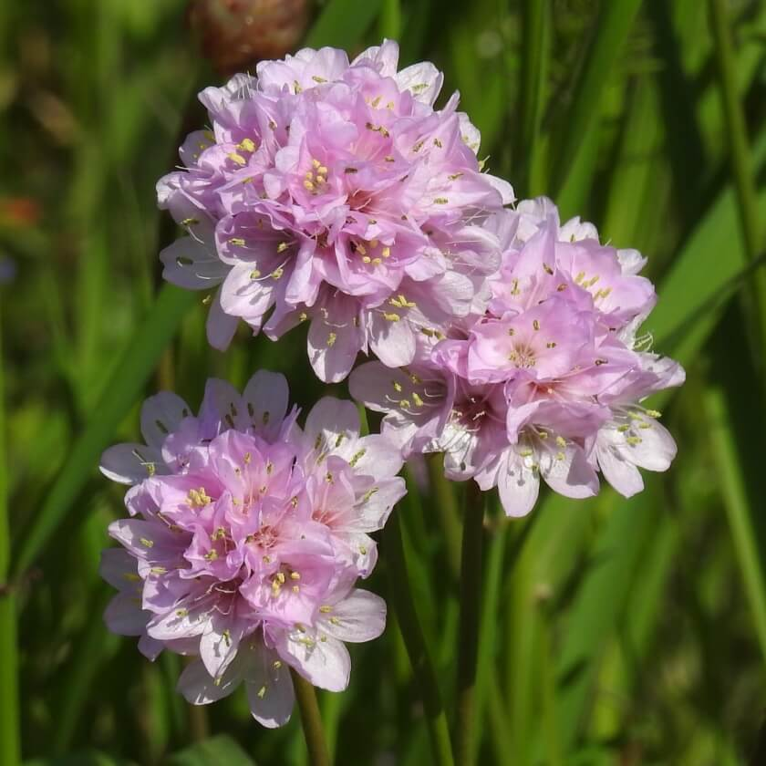
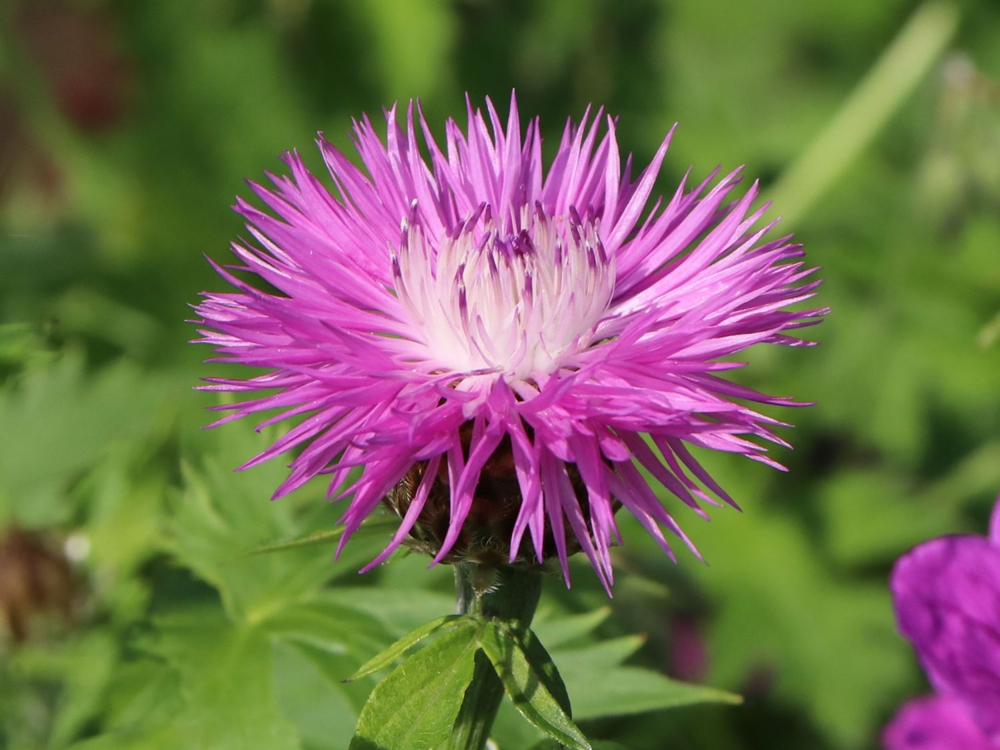
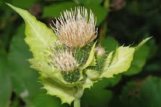
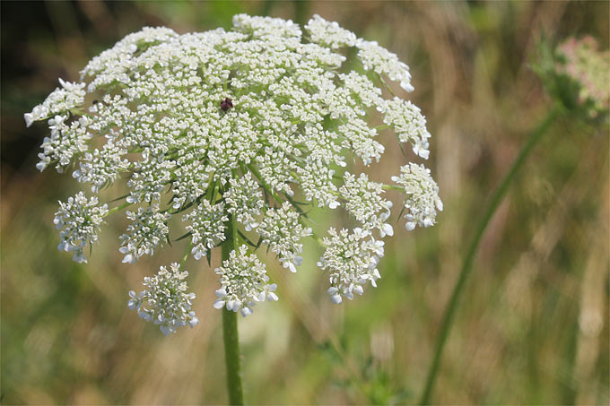
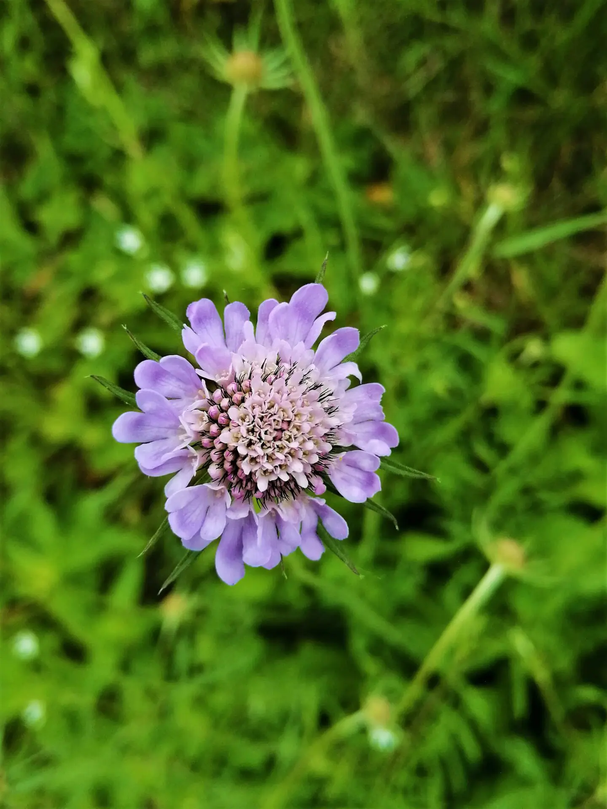
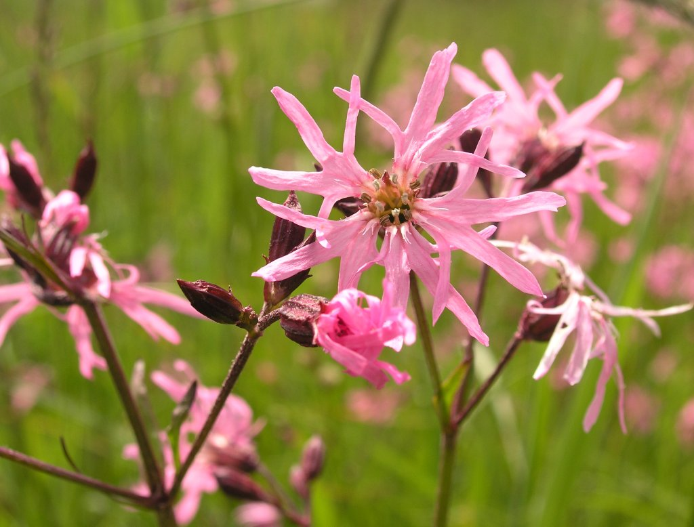

# Pflanzen

## Strand-Grasnelke oder Meeres-Grasnelke

armeria-maritima

## Wiesen-Flockenblume oder Braun-Kornblume

centaurea-jacea

## Kohldistel oder Gemüse-Diestel

cirsium-oleraceum

## Wilde Möhre oder Gemeine Mohrrübe

daucus-carota

## Wilde Feld-Skabiose oder Acker-Skabiose

knautia-arvensis

## Kuckucks-Lichtnelke

lychnis-flos-cuculi

